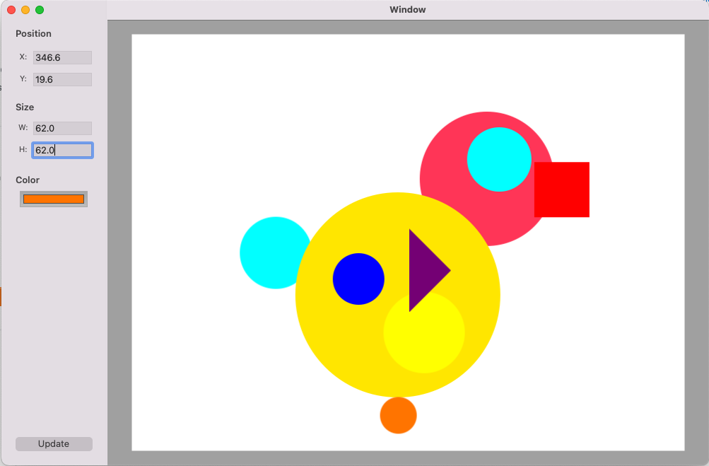
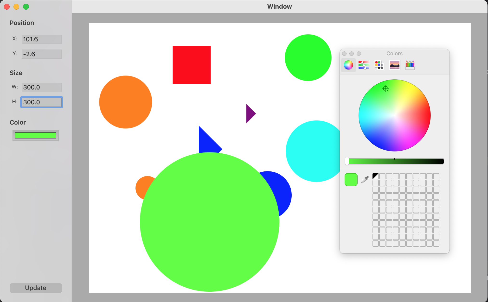

# Code Challenge Sktch
### by Ricardo Montesinos Fernandez

## Features

- [x] App developed based on AppKit

- [x] Random shape generation with random size and colour on user's click.

- [x] Inspector updates when user selects each shape.

- [x] Changes made in the inspector are reflected on the canvas immediately.

- [x] The shapes on the canvas are draggable and changes in the position are reflected, immediately, in the sidebar inspector.

- [x] The Documents can be saved and reopened.

File format is `.frijolito`, example: `MySavedFile.frijolito`

## Screenshots

